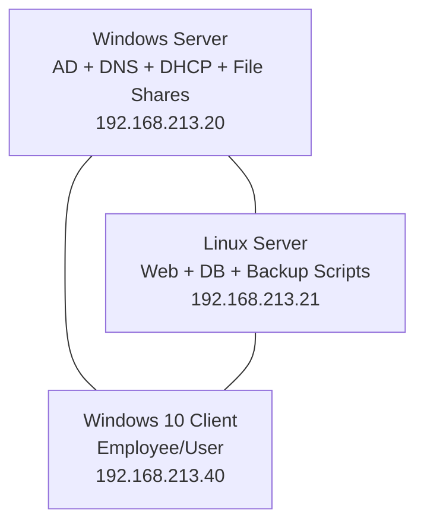

# 🖥️ Hybrid Infrastructure (Windows + Linux) With Monitoring Using Prometheus & Grafana


This project is a **practical lab environment** built on **VMware Workstation/Player** to simulate a small company IT infrastructure.  
It integrates:

- **Windows Server** (Active Directory, DNS, DHCP, File Sharing)  
- **Linux Server** (Web Server, Database, Backup, Bash Scripts, Monitoring)  
- **Windows 10 Client** (Domain User Workstation)

---

## ⚙️ Step 1 – Environment Setup

- **Platform**: VMware Workstation / VMware Player  
- **ISOs Required**:
  - Windows Server 2019/2022  
  - Ubuntu Server (or CentOS/RHEL)  
  - Windows 10 Pro  
- **Network**: Host-Only/Internal (all VMs in the same LAN)

---

## ⚙️ Step 2 – Windows Server (192.168.213.20)

### Install & Configure:
- **Active Directory Domain Services (AD DS)**  
- **DNS Server**  
- **DHCP Server**  
- **Domain**: `shady.local`
  
### Organizational Units (OUs):
- `hr`  
- `it`  
- `sales`  

### Users & Groups:
- Create per-department users/groups.  

### Shared Folders:
- `\\192.168.213.20\hr-folder`  
- `\\192.168.213.20\it-folder`  
- `\\192.168.213.20\sales-folder`


---

## ⚙️ Step 3 – Windows 10 Client (192.168.213.40)

- Configure **Static/DHCP IP**  
- Join **Domain shady.local**  
- Login with **AD user account**  
- Access **shared folders** from Windows Server


---

## ⚙️ Step 4 – Linux Server (192.168.213.21)

### Install Web Server:
```bash
sudo apt update && sudo apt install apache2 -y
echo "Welcome to Corp Web Server" | sudo tee /var/www/html/index.html
```

### Backup Script `/usr/local/bin/backup.sh`:
```bash
#!/bin/bash
DATE=$(date +%F_%H-%M)
BACKUP_DIR="/backup/$DATE"
mkdir -p $BACKUP_DIR
cp -r /var/www/html $BACKUP_DIR
mysqldump -u corpuser -p'Password123' company > $BACKUP_DIR/company.sql
echo "Backup completed at $DATE"
```


### Cron Job (daily at 2 AM):
```bash
0 2 * * * /usr/local/bin/backup.sh
```

---

## 📊 Network Diagram



---

## 📈 Monitoring with Prometheus & Grafana

### Prometheus + Node Exporter (Linux):
```bash
sudo apt install prometheus -y
wget https://github.com/prometheus/node_exporter/releases/download/v*/node_exporter-*.linux-amd64.tar.gz
tar xvf node_exporter-*.tar.gz
./node_exporter &
```

### Prometheus Config (`prometheus.yml`):
```yaml
scrape_configs:
  - job_name: 'linux_server'
    static_configs:
      - targets: ['192.168.213.21:9100']

  - job_name: 'windows_server'
    static_configs:
      - targets: ['192.168.213.20:9182']
```


### Windows Server Exporter:
- Install **WMI Exporter (windows_exporter)**.  
- Default port: **9182**.  
- Provides: CPU, Memory, Disk, Network metrics.


### Grafana Setup:
```bash
sudo apt install grafana -y
sudo systemctl enable grafana-server
sudo systemctl start grafana-server
```

- Access: `http://192.168.213.21:3000`  
- Add **Prometheus** as a data source.  
- Import pre-built dashboards for Linux & Windows.  

---


## 🚀 Outcomes

✅ Centralized authentication & file sharing via Windows Server.  
✅ Domain-joined Windows 10 client.  
✅ Web + Database services on Linux.  
✅ Automated daily backups with Bash scripting.  
✅ Real-time monitoring with Prometheus & Grafana.  

---

Made by [**Shady Emad**](https://github.com/shadyemad2)


